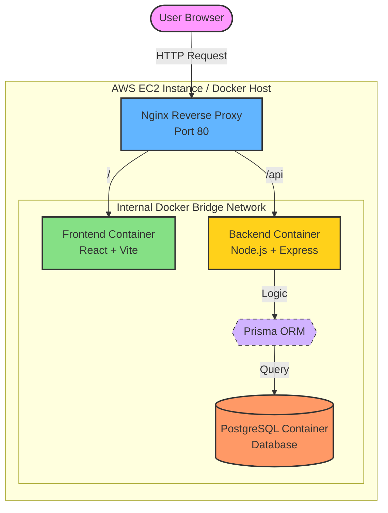
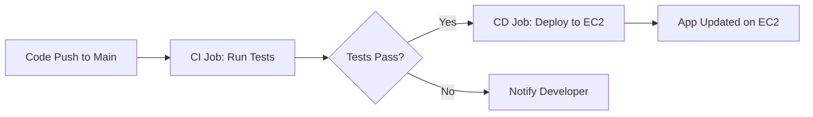

# 🏛️ System Architecture — Task Manager

This document outlines the high-level architecture of the Task Manager application, detailing how the different components interact within the Dockerized environment.

## 📊 Architecture Diagram

The application uses a **Layered Architecture** with a **Reverse Proxy** managing all incoming traffic.

## 🧱 Component Breakdown

### 1. Nginx (Reverse Proxy)
Acts as the gatekeeper for the application. 
- It listens on **Port 80** (standard HTTP).
- It routes traffic based on the URL path:
    - `/` (and all non-API paths) → Sent to the **Frontend** container.
    - `/api` → Sent to the **Backend** container.

### 2. Frontend (React + Vite)
- Serves the compiled static files (HTML, CSS, JS).
- Communicates with the Backend via REST API calls (using Axios).
- Runs within its own Nginx server inside the container.

### 3. Backend (Node.js + Express)
- Handles all business logic and API requests.
- Validates data and manages task/profile operations.
- Communicates with the database through the Prisma ORM.

### 4. Prisma ORM
- Provides a type-safe abstraction over the PostgreSQL database.
- Automatically handles database schema updates on deployment using `npx prisma db push`.

### 5. PostgreSQL (Database)
- A persistent database running in a separate container.
- Uses a **Docker Volume** (`postgres_data`) to ensure data is never lost, even if containers are deleted or rebuilt.

## 🔐 Security & Networking
- **Internal Networking**: All containers communicate over a private bridge network (`taskmanager_network`). 
- **Isolated Ports**: Only the **Nginx** container has its ports exposed to the outside world. The Backend and Database containers are protected behind the proxy.

## ♾️ CI/CD Pipeline

The project uses **GitHub Actions** to automate the integration and deployment process.

### 1. Continuous Integration (CI)
On every push or pull request:
- **Backend**: Generates Prisma client and runs **Jest** API tests.
- **Frontend**: Runs **Vitest** component tests.
- This ensures that broken code never reaches the production server.

### 2. Continuous Deployment (CD)
Only after tests pass on the `main` branch:
- The pipeline connects to the **AWS EC2** instance via SSH.
- It pulls the latest code and runs the `deploy.sh` script.
- The script rebuilds and restarts the Docker containers, minimizing downtime.